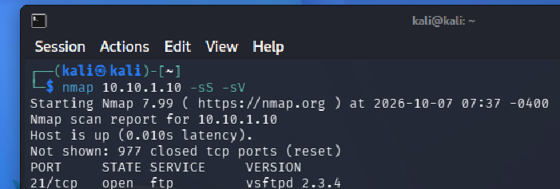
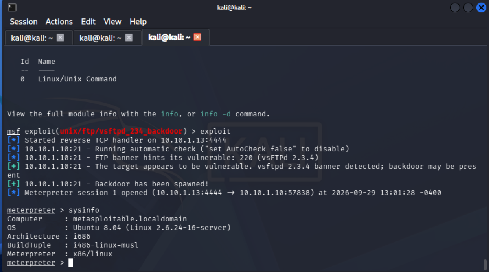
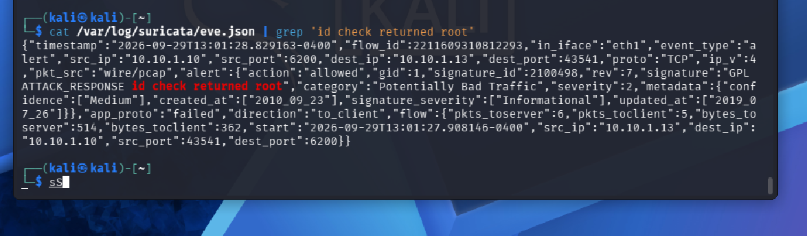

# Metasploitable 2 — vsftpd 2.3.4 Backdoor Exploitation Report

**Exploit:** vsftpd 2.3.4 Backdoor (CVE-2011-2523)
**Target:** Metasploitable 2
**Tester:** Denver
**Date:** 26-09-2026

---

## Overview

## This report documents the identification and exploitation of a known backdoor vulnerability in vsftpd version 2.3.4 running on a Metasploitable 2 target machine. The vulnerability allowed an attacker to gain a root-level shell on the target with no authentication required. Network traffic during the exploitation was monitored using Suricata to demonstrate what detection artifacts the attack generates.

## Scope & Methodology

- **Target system:** Metasploitable 2 (intentionally vulnerable VM, used for authorized training purposes only)
- **Tools used:** Nmap, Metasploit Framework (msfconsole), Suricata
- **Approach:** Standard recon → identify vulnerability → exploit → confirm access → review detection evidence

---

## 1. Reconnaissance

An Nmap scan was performed against the target to identify open ports and running service versions:

```
nmap -sS -sV [target IP]
```

- `-sS`: SYN scan, used to identify open ports without completing a full TCP handshake
- `-sV`: service version detection, used to fingerprint the exact version of services running on open ports

The scan identified vsftpd version 2.3.4 running on port 21. This version is publicly known to contain a backdoor (CVE-2011-2523), in which a specially crafted login string triggers a hidden listener on port 6200 that provides an unauthenticated root shell.

## 

## 2. Exploitation

The Metasploit Framework was used to exploit the identified backdoor:

```
use exploit/unix/ftp/vsftpd_234_backdoor
set RHOSTS [target IP]
exploit
```

The exploit module used was sourced from the Metasploit Framework's built-in module database.
Upon successful exploitation, the vsftpd backdoor on port 6200 was triggered, and Metasploit established a Meterpreter session back to the attacker's reverse TCP handler on port 4444, providing root-level access with no authentication required.

_(Screenshot shown in Section 3 captures both the exploit execution and the resulting root shell.)_

---

## 3. Post-Exploitation Verification

To confirm the level of access obtained, the following commands were run from the resulting shell:

```
sysinfo
getuid
```

The output confirmed the session was running with root privileges, verifying full administrative compromise of the target system.



**Impact:** This level of access allows an attacker to read, modify, or delete any file on the system, create new user accounts, install persistent backdoors, and pivot to other systems on the network — all without needing valid credentials.

---

## 4. Detection & Network Analysis (Suricata)

Suricata was run in the background during the exploitation to capture and analyze the resulting network traffic. `grep` filters were applied to isolate relevant traffic from the broader capture.

The final filtering step searched the log output for the string `id check returned root`, isolating the entry confirming the backdoor session was running with root privileges.



---

## 5. Remediation

- Upgrade vsftpd to a current, non-backdoored version
- Verify package integrity/checksums when installing FTP services, especially from third-party or compromised mirrors
- Restrict FTP service exposure to trusted networks only, or disable if not required
- Monitor for unauthorized listeners on non-standard ports (e.g. port 6200) as an indicator of compromise

---

## Summary

The vsftpd 2.3.4 backdoor vulnerability was successfully identified via version fingerprinting and exploited using Metasploit, resulting in unauthenticated root access to the target system. This confirms the target is vulnerable to CVE-2011-2523 and should not run this vsftpd version in any production environment.

## Lessons Learnt

This was the first time I gained unauthorized remote access of another machine. I used tools like nmap to check the ports of the machine and used that info then search for exploits I could use which led to me gaining access of the metasploitable machine.
